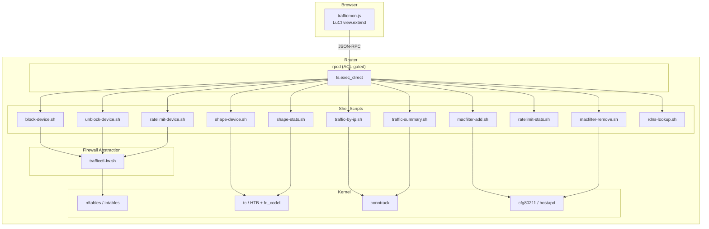

# luci-app-trafficctl

Per-device traffic monitoring and control for OpenWrt routers. Monitor connections, limit bandwidth, shape traffic, block internet access, and manage WiFi MAC filtering -- all from a single LuCI page.

---

## Features

- **Real-time Per-device Monitoring** -- View active connections per device with TCP/UDP counts, TCP state breakdown, destination IPs, and live bandwidth speed.
- **Rate Limiting (Policer)** -- nftables or iptables-based packet dropping when a device exceeds the configured rate. Instant enforcement, no queuing.
- **Traffic Shaping (Queue)** -- tc/HTB classes on the LAN bridge with fq_codel leaf qdiscs. Queues excess traffic instead of dropping, providing smoother throughput.
- **Internet Blocking** -- Layer 3 drop rules per device. Connections are killed immediately and counter stats are tracked.
- **WiFi MAC Filtering** -- Block any device from associating with WiFi. Works across all radio interfaces (2.4 GHz, 5 GHz, 6 GHz) automatically.
- **Live Counters** -- Drop packet counters for the limiter, backlog/byte counters for the shaper, bandwidth speed polling every 2 seconds.
- **Reverse DNS** -- Optional hostname resolution for external destination IPs.
- **Reboot Persistence** -- Shaping rules survive reboot via a hotplug script that restores tc/HTB classes when the LAN interface comes up.

<!-- Screenshots placeholder -->
<!--


-->

---

## Compatibility

| OpenWrt Version | Firewall | Status |
|-----------------|----------|--------|
| 23.05+          | fw4 / nftables | Fully supported |
| 22.03           | fw4 / nftables | Fully supported |
| 21.02           | fw3 / iptables | Supported (auto-detected) |

Runs on all architectures (no compiled code): `mips`, `mipsel`, `arm`, `aarch64`, `x86_64`.

---

## Installation

### From opkg feed (recommended)

```sh
opkg update
opkg install luci-app-trafficctl
```

### From source (OpenWrt build system)

```sh
# Add to your feeds.conf:
echo "src-git trafficctl https://github.com/diusupov/luci-app-trafficctl.git" >> feeds.conf

# Update and install:
./scripts/feeds update trafficctl
./scripts/feeds install luci-app-trafficctl

# Build:
make package/luci-app-trafficctl/compile V=s
```

### Manual installation

Copy files directly to the router:

```sh
scp -r root/usr/local/bin/*.sh root@router:/usr/local/bin/
scp root/usr/share/rpcd/acl.d/luci-app-trafficmon.json root@router:/usr/share/rpcd/acl.d/
scp htdocs/luci-static/resources/view/trafficmon.js root@router:/www/luci-static/resources/view/
scp root/etc/hotplug.d/iface/99-shaperestore root@router:/etc/hotplug.d/iface/

# Set executable permissions
ssh root@router 'chmod +x /usr/local/bin/*.sh'

# Restart rpcd to pick up new ACL
ssh root@router '/etc/init.d/rpcd restart'
```

### Required packages

The package declares `conntrack` and `luci-base` as dependencies. For full functionality:

```sh
# Core (always required)
opkg install conntrack luci-base

# For traffic shaping (optional)
opkg install tc-full kmod-sched-core kmod-sched-cake

# For reverse DNS (optional)
opkg install bind-dig
```

---

## Quick Start

1. Install the package (see above).
2. Navigate to **Status > Traffic Monitor** in LuCI.
3. The dashboard shows all active devices with connection counts and live download speeds.
4. Click any device row to inspect its connections in detail.
5. Use the controls to block, rate-limit, or shape traffic for any device.

---

## Configuration

### Speed Limit Modes

| Mode | Mechanism | Behavior | Best For |
|------|-----------|----------|----------|
| **Limiter** | nft `limit rate` / iptables `hashlimit` | Drops excess packets | Quick enforcement, low overhead |
| **Shaper** | tc/HTB + fq_codel | Queues excess packets | Smooth streaming, lower jitter |

### Rate Units

All rates are specified in **kbit/s** internally. The UI provides presets in Mbit/s and supports custom values in either kbit/s or Mbit/s.

### Persistence

- Shaping rules are saved to `/etc/trafficmon/shapes.json` (a conffile that survives sysupgrade).
- On reboot, the hotplug script at `/etc/hotplug.d/iface/99-shaperestore` re-applies shaping when the LAN interface comes up.
- Rate limiter rules (nft policer) are **not** persisted -- they are intended as temporary throttles.
- Internet block rules are **not** persisted -- they are session-based.

### WiFi MAC Filtering

When a device is WiFi-blocked:
- Its MAC is added to the deny list on **all** wifi-iface sections.
- `macfilter=deny` is set on each interface.
- `wifi reload` is called to apply without full restart.

---

## Architecture



For full architecture details, see [docs/ARCHITECTURE.md](docs/ARCHITECTURE.md).

---

## Documentation

| Document | Description |
|----------|-------------|
| [ARCHITECTURE.md](docs/ARCHITECTURE.md) | Component design, data flow, tc/HTB hierarchy |
| [API.md](docs/API.md) | All scripts, arguments, JSON output formats |
| [COMPATIBILITY.md](docs/COMPATIBILITY.md) | Version matrix, feature parity, known limitations |
| [DEVELOPMENT.md](docs/DEVELOPMENT.md) | Dev environment setup, testing, contributing |

---

## Contributing

Contributions are welcome. Please:

1. Fork the repository and create a feature branch.
2. Test on at least one real OpenWrt device (or QEMU, see [DEVELOPMENT.md](docs/DEVELOPMENT.md)).
3. Ensure both nftables and iptables code paths work if your change touches firewall logic.
4. Keep the single-file JavaScript approach -- no bundlers, no npm, no transpilation.
5. Shell scripts must be POSIX sh compatible (no bashisms).
6. Submit a pull request with a clear description of what and why.

### Code Style

- **JavaScript**: ES5 syntax (LuCI compatibility), `'use strict'`, no external dependencies.
- **Shell**: POSIX `/bin/sh`, always validate IP input, always output JSON.
- **Output**: All scripts emit JSON to stdout. Errors use `{"ok":false,"msg":"..."}`.

---

## License

Licensed under the Apache License, Version 2.0. See [LICENSE](LICENSE) for the full text.

Copyright 2024-2025 Denis Iusupov.
