# luci-app-trafficctl

[](https://github.com/YusDyr/luci-app-trafficctl/actions/workflows/ci.yml)
[](https://github.com/YusDyr/luci-app-trafficctl/actions/workflows/release.yml)
[](https://github.com/YusDyr/luci-app-trafficctl/security/code-scanning)
[](https://github.com/YusDyr/luci-app-trafficctl/releases/latest)
[](LICENSE)

Per-device traffic monitoring and control for OpenWrt routers. Monitor connections, limit bandwidth, shape traffic, block internet access, and manage WiFi MAC filtering -- all from a single LuCI page.

---

## Screenshots

<table>
<tr>
<td align="center"><b>Dashboard — live speed graph</b></td>
<td align="center"><b>Block / Unblock Internet</b></td>
</tr>
<tr>
<td>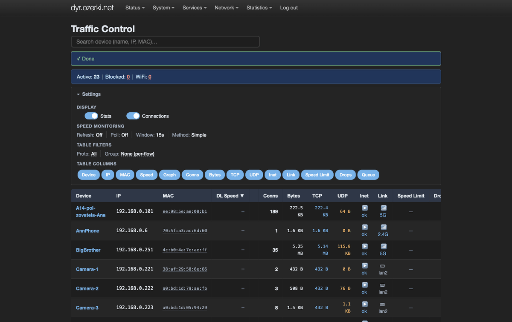</td>
<td>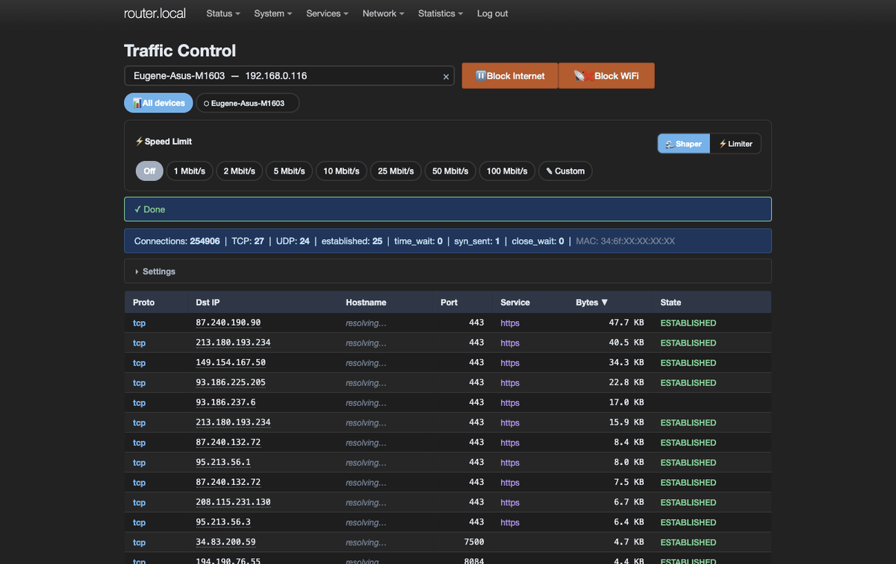</td>
</tr>
<tr>
<td align="center"><b>Rate Limiting &amp; Traffic Shaping</b></td>
<td align="center"><b>Interactive speed graph popup</b></td>
</tr>
<tr>
<td></td>
<td>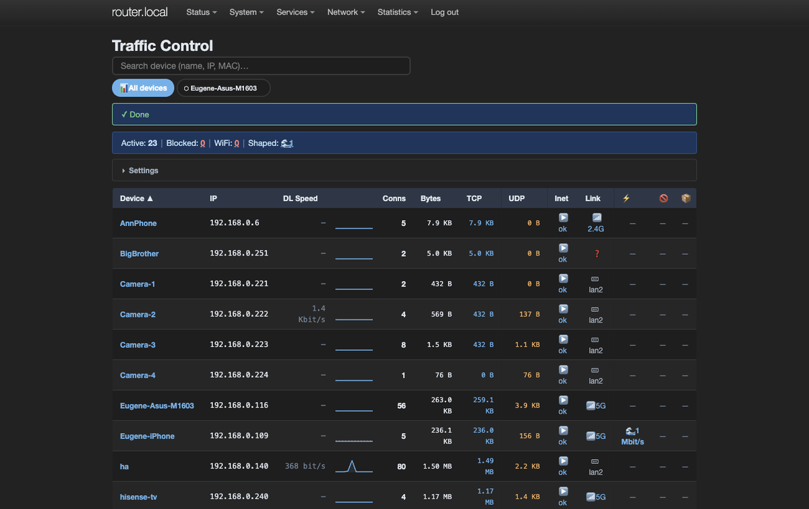</td>
</tr>
</table>

<details>
<summary>More screenshots — light theme, settings, column toggles…</summary>
<br/>

<table>
<tr>
<td align="center"><b>Overview — light theme</b></td>
<td align="center"><b>Per-device connections</b></td>
</tr>
<tr>
<td>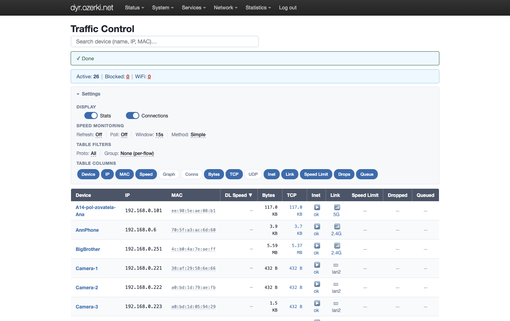</td>
<td>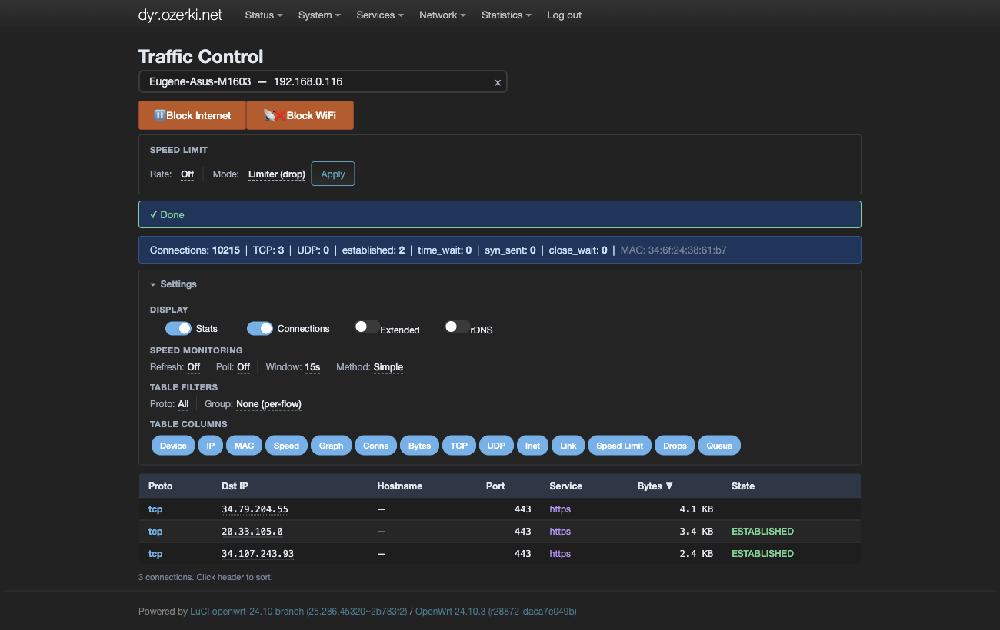</td>
</tr>
<tr>
<td align="center"><b>Settings walkthrough</b></td>
<td align="center"><b>Column toggles</b></td>
</tr>
<tr>
<td>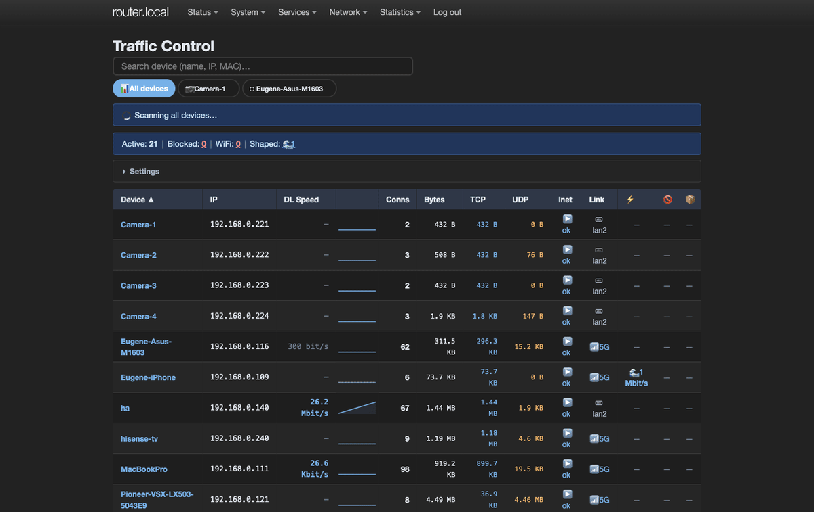</td>
<td>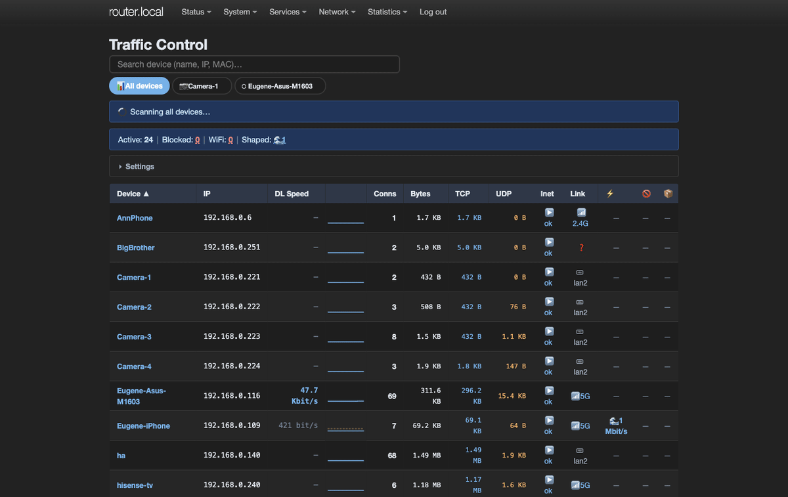</td>
</tr>
<tr>
<td align="center"><b>Telegram Bot toggle</b></td>
<td align="center"><b>Searchable device picker</b></td>
</tr>
<tr>
<td>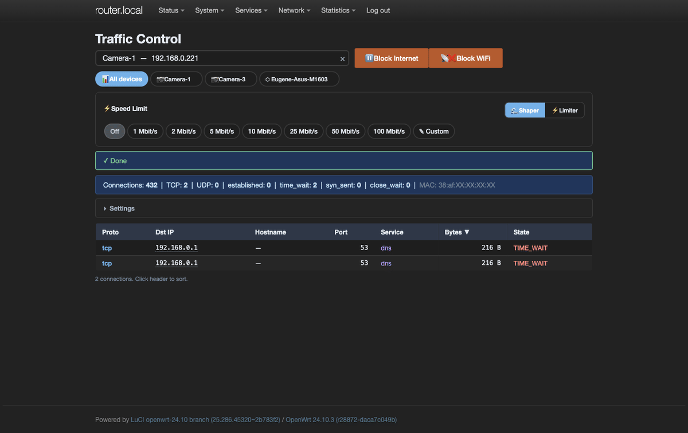</td>
<td>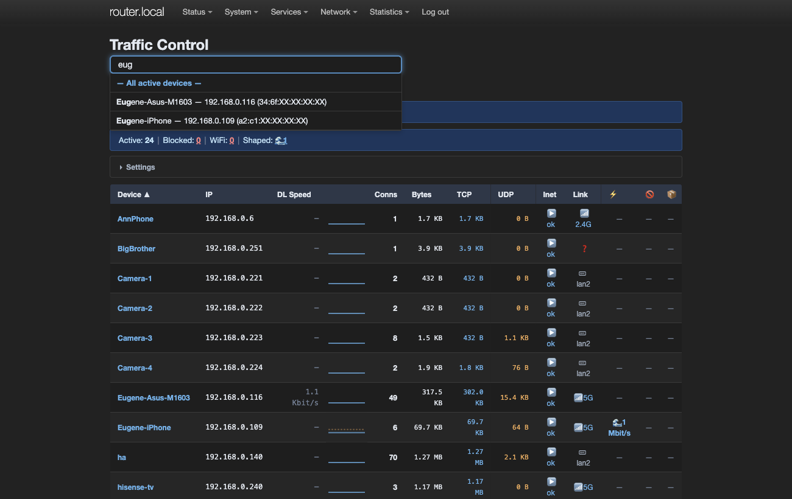</td>
</tr>
<tr>
<td align="center"><b>WiFi blocked</b></td>
<td align="center"><b>Extended statistics</b></td>
</tr>
<tr>
<td>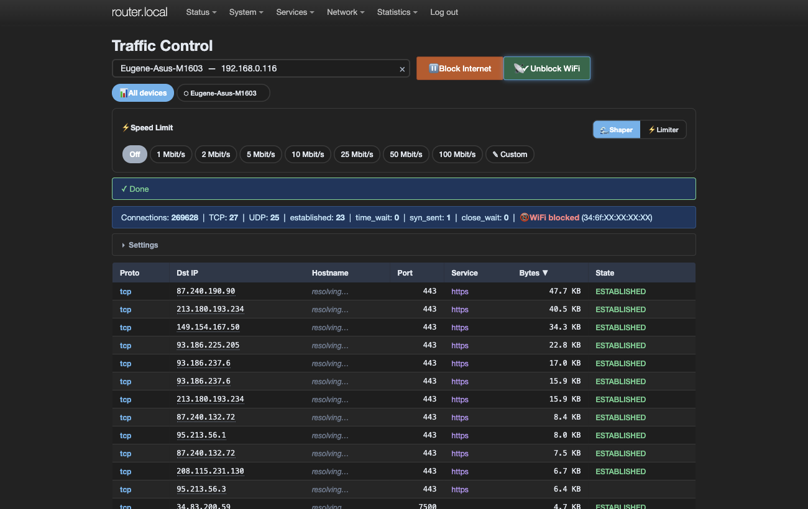</td>
<td>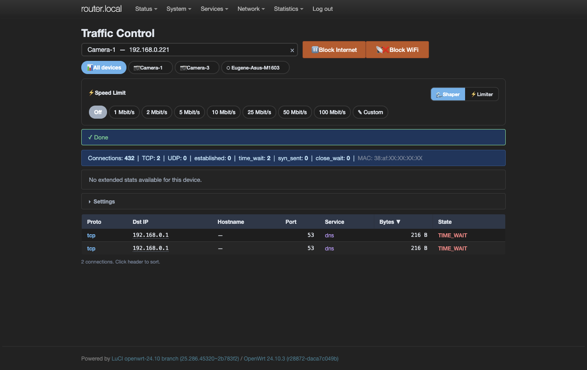</td>
</tr>
<tr>
<td align="center"><b>Group connections by service</b></td>
<td align="center"><b>Settings &amp; subsections</b></td>
</tr>
<tr>
<td>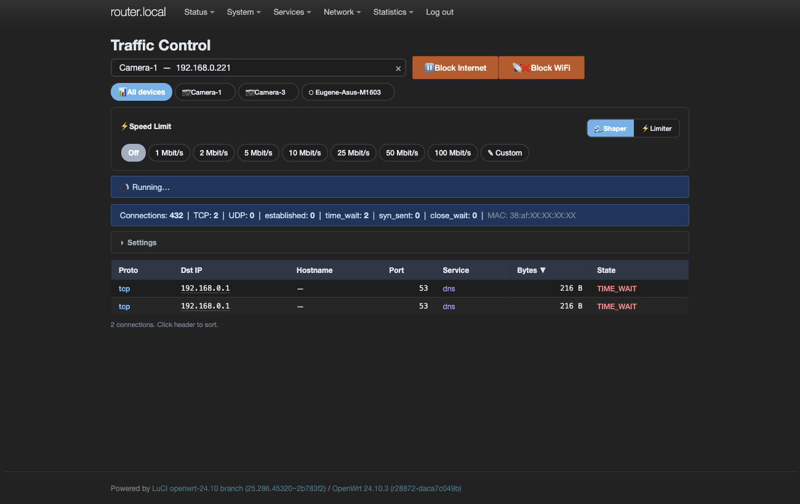</td>
<td></td>
</tr>
</table>

</details>

---

## Features

- **Real-time Per-device Monitoring** -- View active connections per device with TCP/UDP counts, TCP state breakdown, destination IPs, and live bandwidth speed (sparkline graphs with rate limit overlay).
- **Interactive Speed Graphs** -- Hover any sparkline for a full-size popup graph with: download + upload dual lines, gradient area fill, min/max band, crosshair with precise values, rate limit line, nice-value Y axis (multiples of 100/500 Kbit/s). Full history from page load.
- **Traffic Shaping (Queue)** -- tc/HTB classes on the LAN bridge with fq_codel leaf qdiscs. Queues excess traffic instead of dropping, providing smoother throughput.
- **Rate Limiting (Policer)** -- nftables or iptables-based packet dropping when a device exceeds the configured rate. Instant enforcement, no queuing.
- **Internet Blocking** -- Layer 3 drop rules per device. Connections are killed immediately and counter stats are tracked.
- **WiFi MAC Filtering** -- Block any device from associating with WiFi via hostapd_cli deny ACL. Only the target client is deauthenticated -- no wifi reload, other clients stay connected. Works across all radio interfaces (2.4 GHz, 5 GHz, 6 GHz) automatically.
- **Interface Detection** -- Shows actual connection interface: WiFi band (2.4G/5G/6G) or LAN port name (lan2/lan3/lan4).
- **Live Speed Polling** -- Optional polling with configurable interval (default 2s); shows sparkline per device with spike filtering.
- **Reverse DNS** -- Optional hostname resolution for external destination IPs with in-memory cache (no repeated lookups).
- **Searchable Device Picker** -- Command palette (search by name, IP, or MAC) with recent devices quick-access bar stored in localStorage.
- **Telegram Bot** -- Optional bot for remote control: device list, block/unblock, rate limit, shape traffic, new device notifications. Runs on the router via long polling, no external server needed.
- **New Device Detection** -- Discovers new devices via three sources: ARP table, DHCP leases, Wi-Fi station list. Instant DHCP hotplug trigger for near-realtime alerts.
- **Activity Logging** -- Configurable logging of all actions (blocks, ratelimits, shapes, config changes) to a local file and/or syslog. Includes source IP, username, and trigger (LuCI/Telegram/CLI).
- **Reboot Persistence** -- Shaping, block, and rate-limit rules optionally survive reboot via hotplug restore. Configurable per UCI option `persist_rules`.

---

## System Requirements

### Hardware

|               | Minimum              | Recommended          |
|---------------|----------------------|----------------------|
| **RAM**       | 64 MB free           | 128+ MB free         |
| **Flash**     | 300 KB (package)     | 1 MB (with all deps) |
| **CPU**       | Any (MIPS/ARM/x86)   | ARM Cortex-A53+      |

### Software

| Package | Required for | Notes |
|---------|-------------|-------|
| `conntrack` | Core monitoring | Always required |
| `luci-base` | Web interface | Always required |
| `rpcd` | Backend RPC | Always required |
| `tc-full` + `kmod-sched-core` + `kmod-sched-htb` | Traffic shaping | For HTB/fq_codel queues |
| `iw-full` | Interface detection | WiFi band identification |
| `bridge-utils` | Interface detection | LAN port identification (brctl) |
| `curl` + `jsonfilter` | Telegram bot | jsonfilter is part of base OpenWrt |
| `bind-dig` | Reverse DNS | Optional, for hostname resolution |

## Compatibility

| OpenWrt Version | Firewall | Status |
|-----------------|----------|--------|
| 23.05+          | fw4 / nftables | Fully supported |
| 22.03           | fw4 / nftables | Fully supported |
| 21.02           | fw3 / iptables | Supported (auto-detected) |

Runs on all architectures (no compiled code): `mips`, `mipsel`, `arm`, `aarch64`, `x86_64`.

---

## Installation

### From .ipk (recommended)

Download the latest `.ipk` from [Releases](https://github.com/YusDyr/luci-app-trafficctl/releases), copy to the router and install:

```sh
scp luci-app-trafficctl_*_all.ipk root@router:/tmp/
ssh root@router 'opkg install /tmp/luci-app-trafficctl_*_all.ipk'
```

### From source (OpenWrt build system)

```sh
# Add to your feeds.conf:
echo "src-git trafficctl https://github.com/YusDyr/luci-app-trafficctl.git" >> feeds.conf

# Update and install:
./scripts/feeds update trafficctl
./scripts/feeds install luci-app-trafficctl

# Build:
make package/luci-app-trafficctl/compile V=s
```

### Manual installation

Copy the `root/` tree to the router's filesystem, then restart rpcd:

```sh
scp -r root/* root@router:/
scp -r htdocs/luci-static root@router:/www/
ssh root@router 'chmod +x /usr/local/bin/trafficctl-*.sh /usr/libexec/rpcd/luci.trafficctl && /etc/init.d/rpcd restart'
```

### Required packages

```sh
# Core (always required)
opkg install conntrack luci-base

# For traffic shaping
opkg install tc-full kmod-sched-core kmod-sched-htb

# For interface detection
opkg install iw-full

# For reverse DNS (optional)
opkg install bind-dig

# For Telegram bot (optional)
opkg install curl
```

---

## Quick Start

1. Install the package (see above).
2. Navigate to **Status > Traffic Control** in LuCI.
3. The summary table shows all active devices with connection counts, traffic, speed limits, and connection interface.
4. Use the search bar to find a device by name, IP, or MAC.
5. Select a device to see its per-connection detail table.
6. Use the action buttons to pause internet, block WiFi, or set a speed limit.

### Telegram Bot (optional)

1. Create a bot via [@BotFather](https://t.me/BotFather) and copy the token.
2. Send any message to your bot and find your chat ID via `https://api.telegram.org/bot<TOKEN>/getUpdates`.
3. In LuCI, expand **Settings > Telegram Bot**, enter token and chat ID, click **Test**, then **Save**.
4. In Telegram, send `/devices` to see the device list with action buttons.

---

## Configuration

### Speed Limit Modes

| Mode | Mechanism | Behavior | Best For |
|------|-----------|----------|----------|
| **Shaper** | tc/HTB + fq_codel | Queues excess packets | Smooth streaming, lower jitter |
| **Limiter** | nft `limit rate` / iptables `hashlimit` | Drops excess packets | Quick enforcement, low overhead |

### Persistence

- Shaping rules are always saved to `/etc/trafficmon/shapes.json` and restored on boot.
- Block and rate-limit rules are optionally persistent when `persist_rules` is enabled in Settings > Logging & Persistence (saved to `/etc/trafficmon/rules.json`).
- On reboot, the hotplug script at `/etc/hotplug.d/iface/99-trafficctl-shapes` restores all saved rules (shapes, blocks, ratelimits) when the LAN interface comes up.

### Activity Logging

- All mutable actions are logged with timestamp, source IP, username, trigger (luci/telegram/cli), and target.
- Log file: `/tmp/trafficctl/activity.log` (volatile; survives until reboot). Path and max lines are configurable via UCI.
- Optionally duplicates to syslog (`logger -t trafficctl`) for remote log collection.
- Per-category toggles: blocks, ratelimits, shapes, telegram, config changes.

### WiFi MAC Filtering

When a device is WiFi-blocked:
- Its MAC is added to the deny list on **all** wifi-iface sections via UCI.
- `macfilter=deny` is set on each interface.
- At runtime, `hostapd_cli deny_acl ADD_MAC` adds the MAC to the deny ACL and `deauthenticate` disconnects only that client. No wifi reload -- other clients stay connected.

---

## Architecture

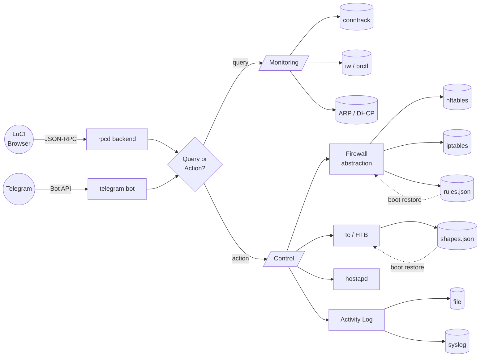

The frontend talks to a thin rpcd dispatcher over ubus. The Telegram bot provides parallel remote control via long polling. Backend shell scripts split into two groups: **monitoring** (read-only, pulls data from conntrack, ARP, DHCP leases, and wireless subsystems) and **control** (writes firewall rules, tc classes, or WiFi MAC filters). A firewall abstraction layer auto-detects nft vs iptables at runtime. All mutable actions are logged to a local file and optionally syslog. Rules optionally persist across reboots via hotplug scripts.

---

## Project Layout

| Path | Role |
|------|------|
| `htdocs/.../view/trafficctl/status.js` | Frontend — single ES5 file, no deps |
| `root/usr/libexec/rpcd/luci.trafficctl` | rpcd backend — JSON-RPC dispatch |
| `root/usr/local/bin/trafficctl-*.sh` | Backend scripts (monitoring + control) |
| `root/usr/local/bin/trafficctl-fw.sh` | Firewall abstraction layer (sourced) |
| `root/usr/local/bin/trafficctl-telegram.sh` | Telegram bot daemon (long polling) |
| `root/etc/init.d/trafficctl-telegram` | procd init script for the bot |
| `root/etc/hotplug.d/iface/99-trafficctl-shapes` | Boot persistence for tc + block + ratelimit rules |
| `root/etc/hotplug.d/dhcp/99-trafficctl-newdevice` | Instant new-device detection via DHCP events |
| `root/usr/share/rpcd/acl.d/` | ACL permissions |
| `Makefile` | OpenWrt package build |
| `docs/` | Extended docs (architecture, API, compat) |

---

## Documentation

| Document | Description |
|----------|-------------|
| [ARCHITECTURE.md](docs/ARCHITECTURE.md) | Component diagram, data flow sequences, tc/HTB hierarchy, security model |
| [API.md](docs/API.md) | All rpcd methods, script arguments, JSON output formats |
| [COMPATIBILITY.md](docs/COMPATIBILITY.md) | OpenWrt version matrix, nft/iptables feature parity, known limitations |
| [DEVELOPMENT.md](docs/DEVELOPMENT.md) | Dev setup, deploy commands, code style, debugging |

---

## Contributing

Contributions are welcome. Please:

1. Fork the repository and create a feature branch.
2. Test on at least one real OpenWrt device.
3. Ensure both nftables and iptables code paths work if your change touches firewall logic.
4. Keep the single-file JavaScript approach -- no bundlers, no npm, no transpilation.
5. Shell scripts must be POSIX sh compatible (BusyBox ash/dash).
6. All scripts emit JSON to stdout.

### Code Style

- **JavaScript**: ES5 syntax (LuCI compatibility), `'use strict'`, no external dependencies.
- **Shell**: POSIX `/bin/sh`, validate all IP input, output JSON only.

---

## License

Licensed under the Apache License, Version 2.0. See [LICENSE](LICENSE) for the full text.

Copyright 2024-2026 Denis Iusupov.
