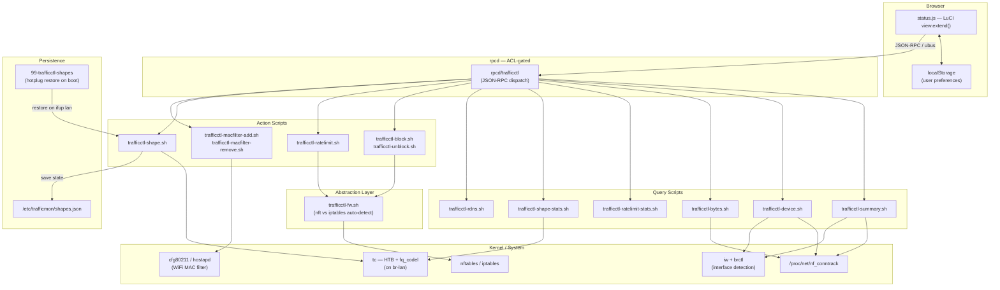

# luci-app-trafficctl

Per-device traffic monitoring and control for OpenWrt routers. Monitor connections, limit bandwidth, shape traffic, block internet access, and manage WiFi MAC filtering -- all from a single LuCI page.

---

## Features

- **Real-time Per-device Monitoring** -- View active connections per device with TCP/UDP counts, TCP state breakdown, destination IPs, and live bandwidth speed (sparkline graphs).
- **Traffic Shaping (Queue)** -- tc/HTB classes on the LAN bridge with fq_codel leaf qdiscs. Queues excess traffic instead of dropping, providing smoother throughput.
- **Rate Limiting (Policer)** -- nftables or iptables-based packet dropping when a device exceeds the configured rate. Instant enforcement, no queuing.
- **Internet Blocking** -- Layer 3 drop rules per device. Connections are killed immediately and counter stats are tracked.
- **WiFi MAC Filtering** -- Block any device from associating with WiFi. Works across all radio interfaces (2.4 GHz, 5 GHz, 6 GHz) automatically.
- **Interface Detection** -- Shows actual connection interface: WiFi band (2.4G/5G/6G) or LAN port name (lan2/lan3/lan4).
- **Live Speed Polling** -- Optional polling with configurable interval or off by default; shows sparkline per device.
- **Reverse DNS** -- Optional hostname resolution for external destination IPs.
- **Searchable Device Picker** -- Inline search by name, IP, or MAC with filtered dropdown.
- **Reboot Persistence** -- Shaping rules survive reboot via a hotplug script that restores tc/HTB classes when the LAN interface comes up.

---

## Compatibility

| OpenWrt Version | Firewall | Status |
|-----------------|----------|--------|
| 23.05+          | fw4 / nftables | Fully supported |
| 22.03           | fw4 / nftables | Fully supported |
| 21.02           | fw3 / iptables | Supported (auto-detected) |

Runs on all architectures (no compiled code): `mips`, `mipsel`, `arm`, `aarch64`, `x86_64`.

---

## Installation

### From source (OpenWrt build system)

```sh
# Add to your feeds.conf:
echo "src-git trafficctl https://github.com/YusDyr/luci-app-trafficctl.git" >> feeds.conf

# Update and install:
./scripts/feeds update trafficctl
./scripts/feeds install luci-app-trafficctl

# Build:
make package/luci-app-trafficctl/compile V=s
```

### Manual installation

Copy files directly to the router:

```sh
scp -r root/usr/local/bin/*.sh root@router:/usr/local/bin/
scp root/usr/libexec/rpcd/trafficctl root@router:/usr/libexec/rpcd/
scp root/usr/share/rpcd/acl.d/luci-app-trafficctl.json root@router:/usr/share/rpcd/acl.d/
scp root/usr/share/luci/menu.d/luci-app-trafficctl.json root@router:/usr/share/luci/menu.d/
scp htdocs/luci-static/resources/view/trafficctl/status.js root@router:/www/luci-static/resources/view/trafficctl/
scp root/etc/hotplug.d/iface/99-trafficctl-shapes root@router:/etc/hotplug.d/iface/

# Set executable permissions
ssh root@router 'chmod +x /usr/local/bin/trafficctl-*.sh /usr/libexec/rpcd/trafficctl'

# Restart rpcd to pick up new ACL
ssh root@router '/etc/init.d/rpcd restart'
```

### Required packages

```sh
# Core (always required)
opkg install conntrack luci-base

# For traffic shaping
opkg install tc-full kmod-sched-core kmod-sched-htb

# For interface detection
opkg install iw-full

# For reverse DNS (optional)
opkg install bind-dig
```

---

## Quick Start

1. Install the package (see above).
2. Navigate to **Status > Traffic Control** in LuCI.
3. The summary table shows all active devices with connection counts, traffic, speed limits, and connection interface.
4. Use the search bar to find a device by name, IP, or MAC.
5. Select a device to see its per-connection detail table.
6. Use the action buttons to pause internet, block WiFi, or set a speed limit.

---

## Configuration

### Speed Limit Modes

| Mode | Mechanism | Behavior | Best For |
|------|-----------|----------|----------|
| **Shaper** | tc/HTB + fq_codel | Queues excess packets | Smooth streaming, lower jitter |
| **Limiter** | nft `limit rate` / iptables `hashlimit` | Drops excess packets | Quick enforcement, low overhead |

### Persistence

- Shaping rules are saved to `/etc/trafficmon/shapes.json`.
- On reboot, the hotplug script at `/etc/hotplug.d/iface/99-trafficctl-shapes` re-applies shaping when the LAN interface comes up.
- Rate limiter rules (nft policer) are **not** persisted -- they are intended as temporary throttles.
- Internet block rules are **not** persisted -- they are session-based.

### WiFi MAC Filtering

When a device is WiFi-blocked:
- Its MAC is added to the deny list on **all** wifi-iface sections.
- `macfilter=deny` is set on each interface.
- `wifi reload` is called to apply without full restart.

---

## Architecture



### Data Flow

1. **Browser** calls `luci.trafficctl.*` via JSON-RPC over ubus.
2. **rpcd** dispatches to shell scripts under `/usr/local/bin/trafficctl-*.sh`.
3. Scripts read from `/proc/net/nf_conntrack`, `tc`, `iw`, `brctl`, and firewall state.
4. All output is JSON to stdout. Errors: `{"ok":false,"msg":"..."}`.
5. **Shaping persistence**: `shapes.json` is written on every tc change; hotplug restores on boot.

### Interface Detection

- WiFi band: `iw dev <iface> info` (channel number) + `iw dev <iface> station dump` (MAC list)
- LAN port: `/sys/class/net/br-lan/brif/*/port_no` + `brctl showmacs br-lan`

---

## File Layout

```
luci-app-trafficctl/
├── htdocs/luci-static/resources/view/trafficctl/
│   └── status.js                    # Frontend (single-file, ES5, no deps)
├── root/
│   ├── etc/
│   │   ├── config/trafficctl        # UCI config placeholder
│   │   └── hotplug.d/iface/
│   │       └── 99-trafficctl-shapes # Restore tc rules on boot
│   ├── usr/
│   │   ├── libexec/rpcd/
│   │   │   └── trafficctl           # rpcd backend (ACL dispatch)
│   │   ├── local/bin/
│   │   │   ├── trafficctl-fw.sh     # Firewall abstraction (nft/iptables)
│   │   │   ├── trafficctl-summary.sh# All-device summary
│   │   │   ├── trafficctl-device.sh # Per-device connections detail
│   │   │   ├── trafficctl-bytes.sh  # Byte counters (speed calc)
│   │   │   ├── trafficctl-block.sh  # Internet block
│   │   │   ├── trafficctl-unblock.sh# Internet unblock
│   │   │   ├── trafficctl-shape.sh  # tc/HTB shaping
│   │   │   ├── trafficctl-shape-stats.sh
│   │   │   ├── trafficctl-ratelimit.sh     # nft policer
│   │   │   ├── trafficctl-ratelimit-stats.sh
│   │   │   ├── trafficctl-macfilter-add.sh # WiFi MAC block
│   │   │   ├── trafficctl-macfilter-remove.sh
│   │   │   └── trafficctl-rdns.sh   # Reverse DNS lookup
│   │   └── share/
│   │       ├── luci/menu.d/
│   │       │   └── luci-app-trafficctl.json  # Menu entry
│   │       └── rpcd/acl.d/
│   │           └── luci-app-trafficctl.json  # ACL permissions
├── Makefile                         # OpenWrt package build
├── po/templates/                    # i18n template
└── docs/                            # Extended documentation
```

---

## Contributing

Contributions are welcome. Please:

1. Fork the repository and create a feature branch.
2. Test on at least one real OpenWrt device.
3. Ensure both nftables and iptables code paths work if your change touches firewall logic.
4. Keep the single-file JavaScript approach -- no bundlers, no npm, no transpilation.
5. Shell scripts must be POSIX sh compatible (BusyBox ash/dash).
6. All scripts emit JSON to stdout.

### Code Style

- **JavaScript**: ES5 syntax (LuCI compatibility), `'use strict'`, no external dependencies.
- **Shell**: POSIX `/bin/sh`, validate all IP input, output JSON only.

---

## License

Licensed under the Apache License, Version 2.0. See [LICENSE](LICENSE) for the full text.

Copyright 2024-2025 Denis Iusupov.
