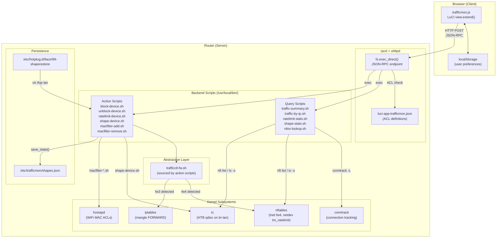
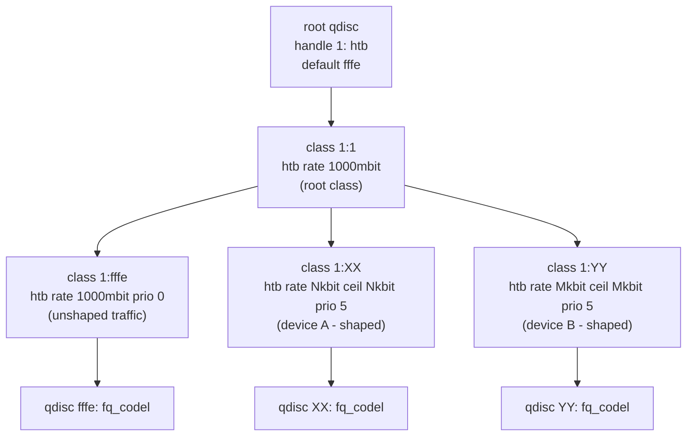
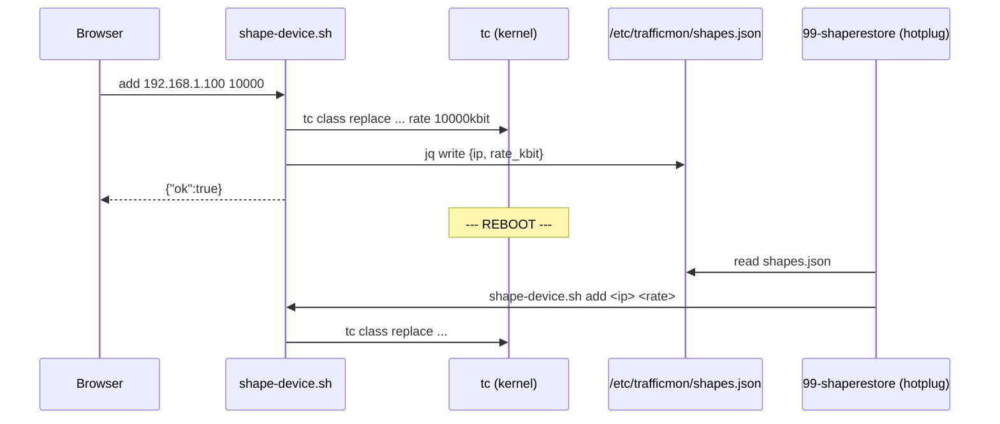

# Architecture

This document describes the internal architecture of luci-app-trafficctl.

---

## Design Principles

1. **No daemon** -- All operations are on-demand. No background process runs when the UI is closed.
2. **No compiled code** -- Pure shell scripts and JavaScript. Runs on any architecture without compilation.
3. **Firewall agnostic** -- Automatically detects nftables or iptables at runtime. The same package works on OpenWrt 21.02 (fw3) through 23.05+ (fw4).
4. **Minimal dependencies** -- Only requires `conntrack` and `luci-base`. Traffic shaping requires `tc-full` and `kmod-sched-core` (optional).

---

## Component Diagram



---

## Data Flow

### Dashboard (All Devices View)

```
Browser                  Router
  |                        |
  |-- traffic-summary.sh ->|-- conntrack -L (all connections)
  |                        |-- nft list chain inet fw4 forward (block status)
  |                        |-- nft list chain netdev tm_ratelimit dl (rate limits)
  |                        |-- tc class show dev br-lan (shaping status)
  |                        |-- /tmp/dhcp.leases (device names + MACs)
  |                        |-- uci show wireless (WiFi deny lists)
  |<-- JSON array ---------|
  |                        |
  |-- traffic-bytes.sh --->|-- iptables/nft byte counters (every 2s)
  |<-- JSON array ---------|
  |                        |
  |-- ratelimit-stats.sh ->|-- nft counter parsing (every 5s)
  |<-- JSON array ---------|
  |                        |
  |-- shape-stats.sh ----->|-- tc -s class show dev br-lan (every 5s)
  |<-- JSON array ---------|
```

### Per-Device View

```
Browser                  Router
  |                        |
  |-- traffic-by-ip.sh --->|-- conntrack -L -s <IP>
  |     [ip, --proto tcp]  |-- nft list (block + rate check)
  |                        |-- tc class show (shaper check)
  |                        |-- /tmp/dhcp.leases (name + MAC)
  |                        |-- uci show wireless (WiFi status)
  |<-- JSON object --------|
  |                        |
  |-- rdns-lookup.sh ----->|-- dig -x <IP> (optional, per external IP)
  |<-- {"ip","host"} ------|
```

### Action Flow (Example: Apply Shaper)

```
Browser                  Router
  |                        |
  |-- shape-device.sh ---->|
  |   [add, ip, 10000, n]  |-- tc qdisc replace dev br-lan root handle 1: htb ...
  |                        |-- tc class replace dev br-lan parent 1:1 classid 1:XX htb rate 10000kbit
  |                        |-- tc qdisc replace dev br-lan parent 1:XX handle XX: fq_codel
  |                        |-- tc filter replace dev br-lan parent 1: ... match ip dst <IP>/32
  |                        |-- save to /etc/trafficmon/shapes.json
  |<-- {"ok":true} --------|
```

---

## Firewall Abstraction Layer

The file `trafficctl-fw.sh` is sourced by action scripts. It provides a unified API regardless of the firewall backend:

```sh
. /usr/local/bin/trafficctl-fw.sh

# Detection result stored in:
# TCTL_FW = "nft" | "iptables"
```

### Detection Logic

```
if command -v nft exists AND nft list tables returns results:
    TCTL_FW = "nft"
else:
    TCTL_FW = "iptables"
```

### Provided Functions

| Function | nft implementation | iptables implementation |
|----------|-------------------|------------------------|
| `tctl_ratelimit_add` | `nft add rule netdev tm_ratelimit dl ip daddr ... limit rate over ... drop` | `iptables -t mangle -A FORWARD ... -m hashlimit ... -j DROP` |
| `tctl_ratelimit_remove` | Delete rules by handle from `netdev tm_ratelimit dl` | `iptables -t mangle -D FORWARD ... -m comment --comment ...` |
| `tctl_block_add` | `nft add rule inet fw4 forward ip saddr ... drop` | `iptables -I FORWARD -s ... -j DROP` |
| `tctl_block_remove` | Delete rules by handle from `inet fw4 forward` | `iptables -D FORWARD -s ... -j DROP` (loop until gone) |
| `tctl_is_blocked` | grep nft forward chain | grep iptables FORWARD chain |
| `tctl_get_wan_device` | `uci get network.wan.device` (fallback to `.ifname`) | Same |
| `tctl_get_lan_device` | `uci get network.lan.device` (fallback to `.ifname`) | Same |
| `tctl_validate_ip` | regex match | Same |
| `tctl_get_wifi_interfaces` | `uci show wireless` parsing | Same |

---

## tc/HTB Hierarchy

Traffic shaping uses a single HTB qdisc on the LAN bridge egress (br-lan). This controls download speed to LAN devices.



### Class ID Encoding

Each device gets a unique class ID derived from its IP address:

```
classid = 1:<hex(third_octet * 256 + fourth_octet)>

Example: 192.168.1.100
  third_octet  = 1
  fourth_octet = 100
  decimal      = 1 * 256 + 100 = 356
  hex          = 0x164
  classid      = 1:164
```

This means:
- No collision between devices on the same subnet.
- Supports up to 65534 devices (the full /16 range minus reserved IDs).
- Class ID `1:1` is the root class, `1:fffe` is the default (unshaped) class.

### Filter Matching

A u32 filter routes packets to the correct class:

```
tc filter ... protocol ip prio <decimal_id> u32 match ip dst <IP>/32 flowid 1:<hex_id>
```

---

## Polling Architecture

The frontend uses three independent polling loops when in dashboard (all-devices) mode:

| Poll | Interval | Script | Purpose |
|------|----------|--------|---------|
| Bytes | 2 seconds | `traffic-bytes.sh` | Bandwidth speed calculation (delta bytes / delta time) |
| Drops | 5 seconds | `ratelimit-stats.sh` | nft drop counter for rate-limited devices |
| Shapes | 5 seconds | `shape-stats.sh` | tc backlog and byte counters for shaped devices |

All polling stops when:
- The browser tab is hidden (`document.hidden === true`).
- The user switches to per-device view.
- The user navigates away from the page.

The main device list refresh uses the configurable auto-refresh interval (off, 5s, 10s, 30s, 60s).

---

## WiFi Interface Detection

WiFi MAC filtering does not hardcode interface names. Instead, it dynamically discovers all wifi-iface sections:

```sh
uci show wireless | grep '=wifi-iface' | cut -d= -f1
```

This returns paths like `wireless.default_radio0`, `wireless.default_radio1`, etc. The scripts then:
1. Set `macfilter=deny` on each interface.
2. Add/remove the target MAC from each interface's `maclist`.
3. Run `wifi reload` to apply changes without a full restart.

This approach works regardless of:
- Number of radios (single, dual, tri-band).
- Interface naming conventions.
- Whether interfaces are bridged or isolated.

---

## Persistence Mechanism

Only traffic shaping rules are persisted across reboots. The design is intentional:

| Feature | Persisted | Rationale |
|---------|-----------|-----------|
| Shaping (tc/HTB) | Yes | Long-term bandwidth allocation, e.g., kids' devices |
| Rate limiting (nft policer) | No | Temporary throttle, meant to be short-lived |
| Internet blocking | No | Emergency block, should require re-confirmation |
| WiFi MAC filtering | Yes (via uci) | Changes are committed to `/etc/config/wireless` |

### Persistence Flow



The hotplug script triggers on `ACTION=ifup` and `INTERFACE=lan`, ensuring tc rules are applied only after the bridge interface is ready.

---

## Security Model

- All script execution is gated by rpcd ACLs defined in `luci-app-trafficmon.json`.
- Only authenticated LuCI admin users can invoke scripts.
- All scripts validate IP input with a regex before any operation.
- No user-supplied strings are passed to shell eval -- all parameters use positional arguments.
- The `comment` fields in nft rules use sanitized identifiers (IP with dots replaced by dashes).
