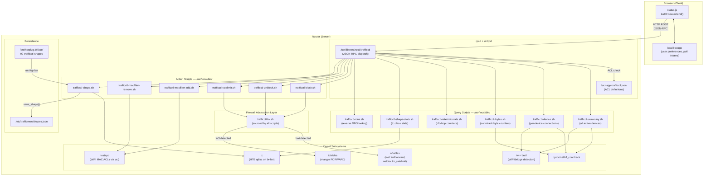
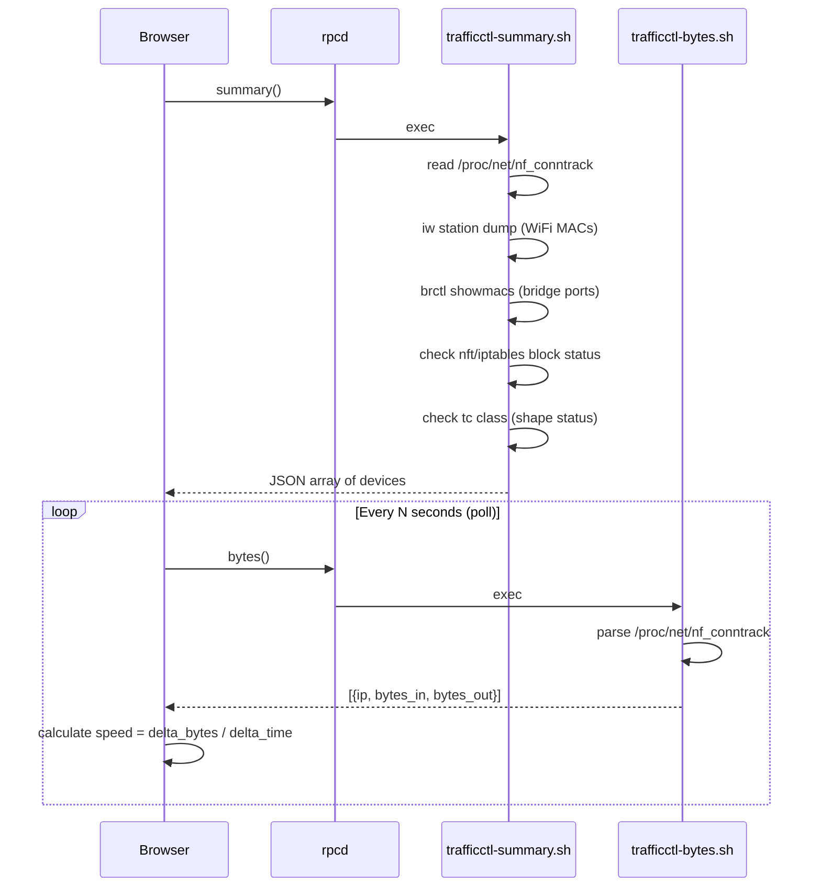
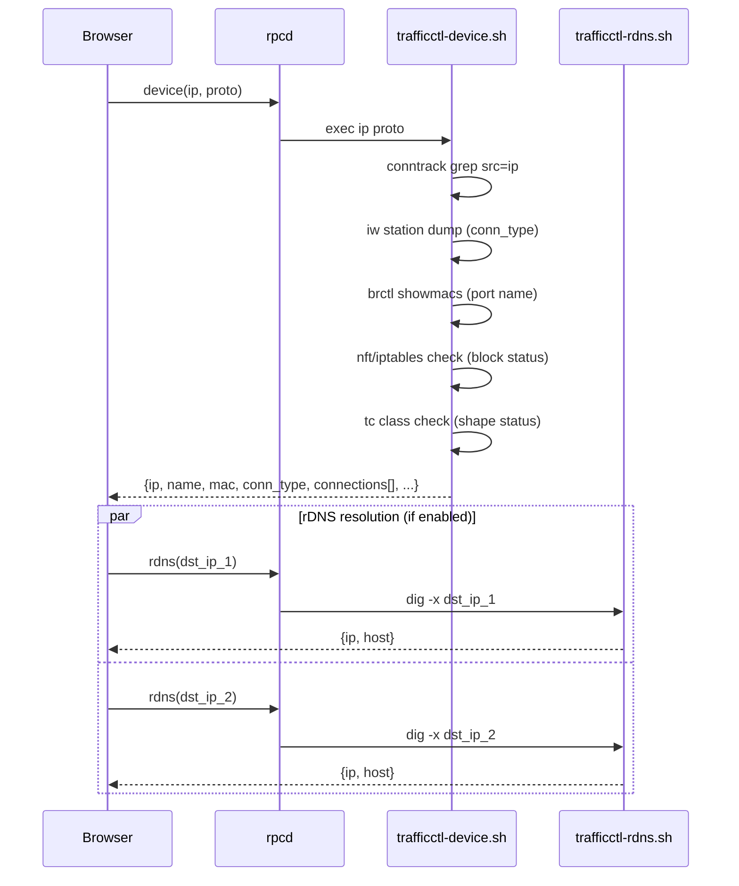
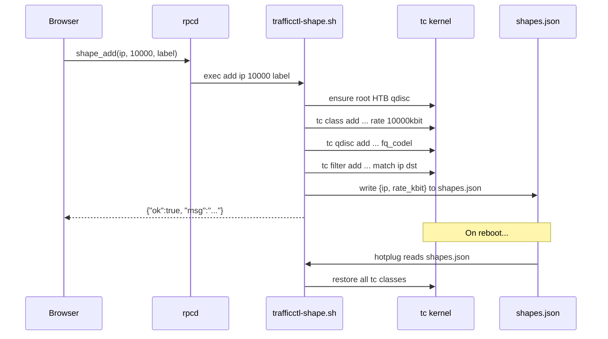
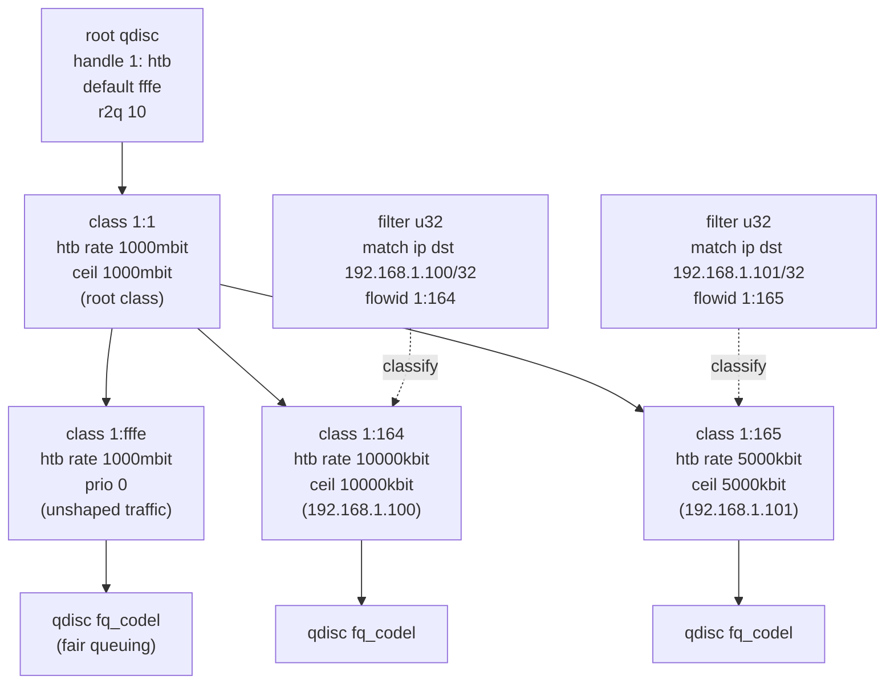
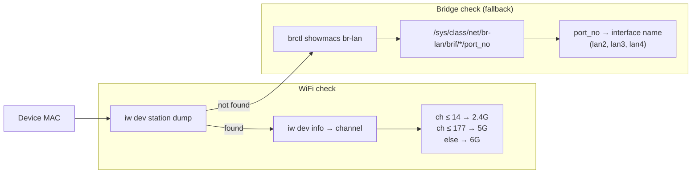

# Architecture

This document describes the internal architecture of luci-app-trafficctl.

---

## Design Principles

1. **No daemon** -- All operations are on-demand. No background process runs when the UI is closed.
2. **No compiled code** -- Pure shell scripts and JavaScript. Runs on any architecture without compilation.
3. **Firewall agnostic** -- Automatically detects nftables or iptables at runtime. The same package works on OpenWrt 21.02 (fw3) through 23.05+ (fw4).
4. **Minimal dependencies** -- Only requires `conntrack` and `luci-base`. Traffic shaping requires `tc-full` and `kmod-sched-htb` (optional).

---

## Component Diagram



---

## Data Flow

### Dashboard (All Devices View)



### Per-Device View



### Action Flow (Example: Apply Shaper)



---

## Firewall Abstraction Layer

The file `trafficctl-fw.sh` is sourced by all scripts. It provides a unified API regardless of the firewall backend:

```sh
. /usr/local/bin/trafficctl-fw.sh

# Detection result stored in:
# TCTL_FW = "nft" | "iptables"
```

### Detection Logic

```
if command -v nft exists AND nft list tables returns results:
    TCTL_FW = "nft"
else:
    TCTL_FW = "iptables"
```

### Provided Functions

| Function | nft implementation | iptables implementation |
|----------|-------------------|------------------------|
| `tctl_ratelimit_add` | `nft add rule netdev tm_ratelimit dl ip daddr ... limit rate over ... drop` | `iptables -t mangle -A FORWARD ... -m hashlimit ... -j DROP` |
| `tctl_ratelimit_remove` | Delete rules by handle from `netdev tm_ratelimit dl` | `iptables -t mangle -D FORWARD ... -m comment --comment ...` |
| `tctl_block_add` | `nft add rule inet fw4 forward ip saddr ... drop` | `iptables -I FORWARD -s ... -j DROP` |
| `tctl_block_remove` | Delete rules by handle from `inet fw4 forward` | `iptables -D FORWARD -s ... -j DROP` (loop until gone) |
| `tctl_is_blocked` | grep nft forward chain | grep iptables FORWARD chain |
| `tctl_get_wan_device` | `uci get network.wan.device` (fallback to `.ifname`) | Same |
| `tctl_get_lan_device` | `uci get network.lan.device` (fallback to `.ifname`) | Same |
| `tctl_validate_ip` | regex + octet range check | Same |
| `tctl_get_wifi_interfaces` | `uci show wireless` parsing | Same |

---

## tc/HTB Hierarchy

Traffic shaping uses a single HTB qdisc on the LAN bridge egress (br-lan). This controls download speed to LAN devices.



### Class ID Encoding

Each device gets a unique class ID derived from its IP address:

```
classid = 1:<hex(third_octet * 256 + fourth_octet)>

Example: 192.168.1.100
  third_octet  = 1
  fourth_octet = 100
  decimal      = 1 * 256 + 100 = 356
  hex          = 0x164
  classid      = 1:164
```

This means:
- No collision between devices on the same subnet.
- Supports up to 65534 devices (the full /16 range minus reserved IDs).
- Class ID `1:1` is the root class, `1:fffe` is the default (unshaped) class.

### Filter Matching

A u32 filter routes packets to the correct class:

```
tc filter add dev br-lan parent 1:0 prio 10 protocol ip u32 \
    match ip dst <IP>/32 flowid 1:<hex_id>
```

---

## Interface Detection

The system detects how each device is connected (WiFi band or LAN port):



---

## Polling Architecture

The frontend uses independent polling loops:

| Poll | Interval | Script | Purpose |
|------|----------|--------|---------|
| Bytes | Configurable (2s–60s, or off) | `trafficctl-bytes.sh` | Bandwidth speed = delta bytes / delta time |
| Summary | On-demand / auto-refresh | `trafficctl-summary.sh` | Full device list refresh |

Polling stops when:
- The browser tab is hidden (`document.hidden === true`).
- The user switches to per-device view (only device-specific polls run).
- The user sets poll to "Off".
- The user navigates away (timers cleared in `handleTeardown()`).

---

## WiFi MAC Filtering

WiFi MAC filtering does not hardcode interface names. It dynamically discovers all wifi-iface sections:

```sh
uci show wireless | grep '=wifi-iface' | cut -d= -f1
```

This returns paths like `wireless.default_radio0`, `wireless.default_radio1`, etc. The scripts then:
1. Set `macfilter=deny` on each interface.
2. Add/remove the target MAC from each interface's `maclist`.
3. Run `wifi reload` to apply changes without a full restart.

---

## Persistence

Only traffic shaping rules are persisted across reboots:

| Feature | Persisted | Rationale |
|---------|-----------|-----------|
| Shaping (tc/HTB) | Yes (`shapes.json`) | Long-term bandwidth allocation |
| Rate limiting (nft policer) | No | Temporary throttle, short-lived |
| Internet blocking | No | Emergency block, should require re-confirmation |
| WiFi MAC filtering | Yes (via `uci commit wireless`) | Committed to `/etc/config/wireless` |

The hotplug script triggers on `ACTION=ifup` and `INTERFACE=lan`, with a readiness loop (waits up to 10s for tc to be available on the bridge device).

---

## Security Model

- All script execution is gated by rpcd ACLs (`luci-app-trafficctl.json`).
- Only authenticated LuCI admin users can invoke scripts.
- IP validation: regex + octet range (0–255) before any operation.
- Label/comment sanitization: `tr -cd 'a-zA-Z0-9_.-'` strips injection characters.
- Protocol parameter: `case` whitelist (`tcp|udp|all`), not interpolated.
- No user-supplied strings are passed to shell eval.
- File locking for concurrent `shapes.json` writes.
